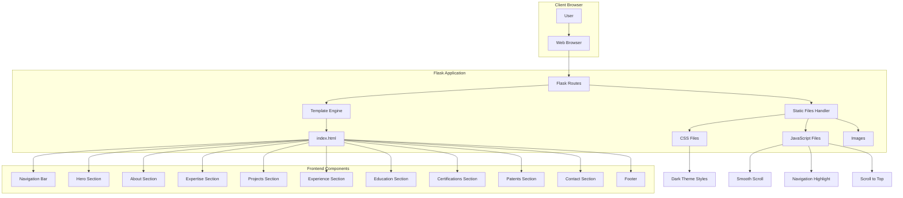
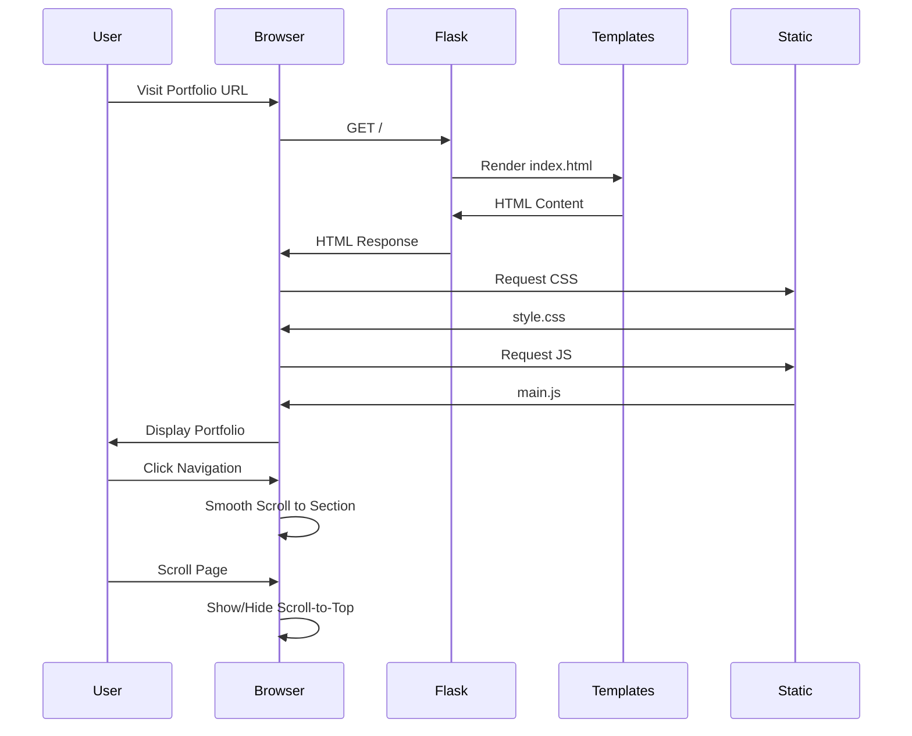
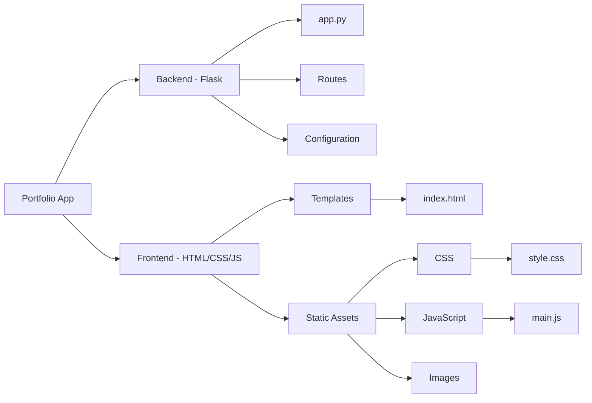
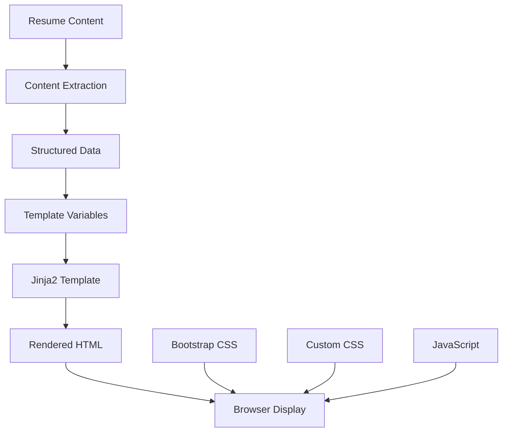
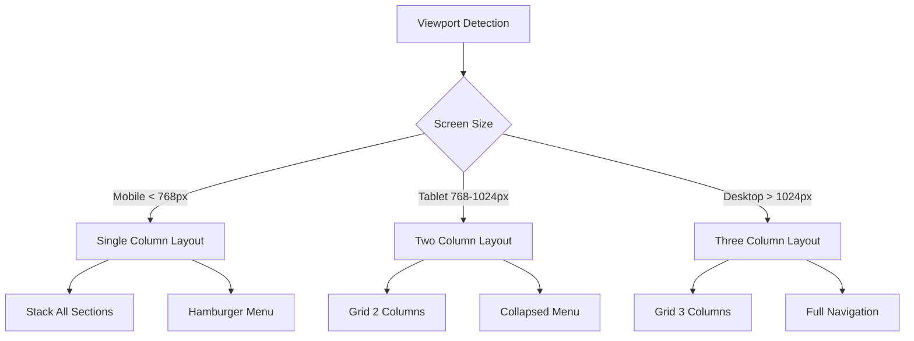
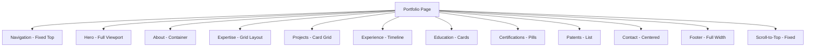
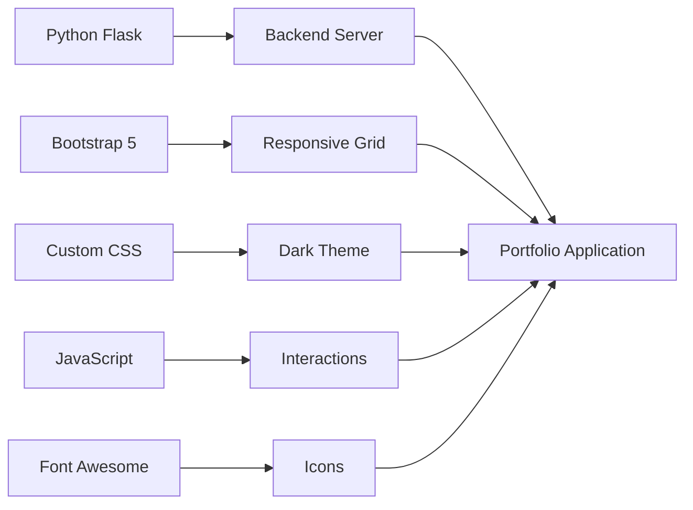
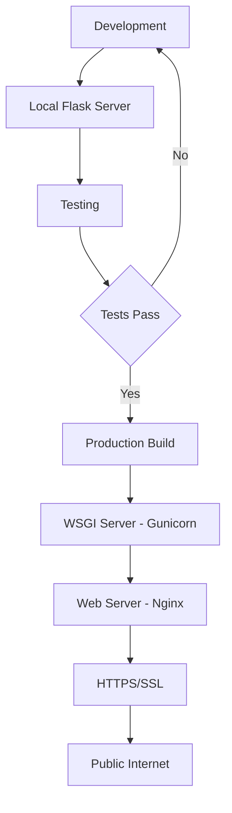
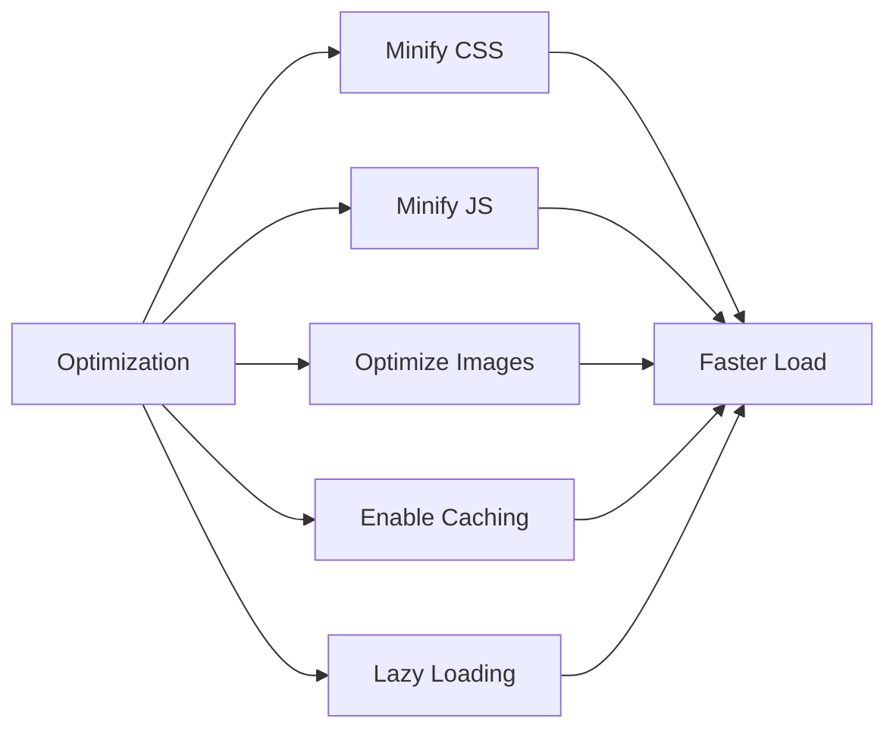

# Portfolio Application Architecture

## System Architecture Diagram



## Application Flow



## Component Structure



## Data Flow



## Responsive Design Strategy



## Section Layout Structure



## Technology Stack Integration



## Deployment Architecture



## File Organization

```
portfolio/
│
├── app.py                          # Flask application entry point
│   ├── Route: / (index)
│   └── Static file serving
│
├── templates/
│   └── index.html                  # Main template
│       ├── Navigation
│       ├── Hero Section
│       ├── About Section
│       ├── Expertise Section
│       ├── Projects Section
│       ├── Experience Section
│       ├── Education Section
│       ├── Certifications Section
│       ├── Patents Section
│       ├── Contact Section
│       └── Footer
│
├── static/
│   ├── css/
│   │   └── style.css              # Custom styles
│   │       ├── Variables
│   │       ├── Base styles
│   │       ├── Navigation styles
│   │       ├── Section styles
│   │       ├── Component styles
│   │       └── Responsive styles
│   │
│   ├── js/
│   │   └── main.js                # JavaScript functionality
│   │       ├── Smooth scrolling
│   │       ├── Navigation highlight
│   │       ├── Scroll-to-top
│   │       └── Mobile menu toggle
│   │
│   └── images/                    # Image assets
│
├── requirements.txt               # Python dependencies
├── README.md                      # Documentation
├── .gitignore                    # Git ignore rules
└── PORTFOLIO_SPECIFICATION.md    # Technical specs
```

## Key Design Patterns

### 1. Single Page Application (SPA) Pattern
- All content on one page
- Smooth scroll navigation between sections
- No page reloads

### 2. Mobile-First Responsive Design
- Base styles for mobile
- Progressive enhancement for larger screens
- Flexible grid system

### 3. Component-Based Structure
- Reusable CSS classes
- Modular JavaScript functions
- Semantic HTML sections

### 4. Dark Theme Implementation
- CSS custom properties for colors
- Consistent color palette
- High contrast for accessibility

## Performance Optimization



## Security Considerations

- Flask security headers
- HTTPS enforcement
- Input validation (if contact form added)
- CSRF protection
- Content Security Policy

## Browser Compatibility

- Chrome (latest 2 versions)
- Firefox (latest 2 versions)
- Safari (latest 2 versions)
- Edge (latest 2 versions)
- Mobile browsers (iOS Safari, Chrome Mobile)